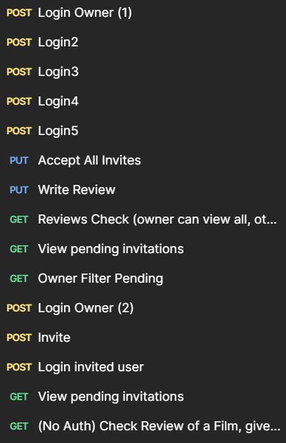

# Project Structure

### JSON Schemas/

Contains the JSON schemas used for data validation.

### REST APIs Design/

Contains the OpenAPI specification (openapi.yaml and openapi.json) describing the modified REST APIs and the Postman Collection, that can be used to test the APIs by following the instructions in the README below.

### REST APIs Implementation/

Contains the Node.js server implementation.

### controllers/

Handles HTTP requests and maps them to service logic.

### service/

Contains the business logic and database interactions.

### components/

Database connection and data models.

### database/

SQLite database files

# Instructions to Run the Code

### Install Dependencies: 
Navigate to the implementation folder:

```bash
cd "REST APIs Implementation"
npm install
```

Start the server

```bash
cd "REST APIs Implementation"
node index.js
```

# Testing

The API is available at: http://localhost:3001

Swagger Documentation: http://localhost:3001/docs

# Main Design Choices

To meet the exam specifications while maintaining the architecture of Lab 1, the following design choices were implemented:

### 1. Lazy Evaluation for Expiration

Instead of implementing a server-side timer or a cron job to update the database status to expired or cancelled, the system uses Lazy Evaluation.

- Logic: The database retains the pending status and the expirationDate. The "cancelled" state is a computed property, not a stored one.

- Implementation: When data is requested (GET), the service compares expirationDate with the current server time (datetime('now')). If now > expirationDate, the invitation is transformed and returned as cancelled (or expired) to the client on the fly.

- Benefit: This approach makes the service stateless and lightweight, avoiding complex background process management while strictly satisfying the requirement that expired invitations "automatically become invisible" or cancelled from the user's perspective, ensuring data consistency without asynchronous jobs.

### 2. Review Lifecycle & State Machine
The reviews table is extended with an invitationStatus column. The flow is enforced as follows:

- pending: Created by the owner. Visible to the invitee (if not expired).

- accepted: set via the "Accept All" operation. Required before writing a review.

- completed: Set when the user submits the text/rating. Visible to the public.

- cancelled (Virtual): A pending review where the expiration date has passed. Visible only to the owner as historic data.

### 3. Atomic State Transitions
- Critical state changes, specifically the "Accept All" operation, are implemented as single atomic SQL UPDATE statements rather than Read-Modify-Write sequences.

- Detail: The query updates only rows that are currently pending AND valid (not expired), checking the condition again at the exact moment of writing.

- Benefit: This prevents race conditions where a user might accidentally accept an invitation the exact moment it expires, maintaining strict data integrity without requiring complex transaction locks.

### 4. Security & Data Integrity
Several safeguards are implemented to prevent logic abuse:

- Anti-Spoofing: The API validates that the reviewerId in the URL matches the authenticated req.user.id during review updates. Users cannot complete reviews assigned to others.

- Review Locking: A user cannot submit a review (PUT) unless they have explicitly transitioned the state to accepted first.

- Input Validation: Ratings are strictly validated to be integers between 1 and 10.

# Demonstration Flow & Test Scenarios

The database provided with this project (database.db) is pre-populated to demonstrate all functional requirements immediately:

- User1: Owner of a film with filmId1

- User2 (Invitee - Active): Has a pending invitation (valid date) for filmId1.

- User3 (Invitee - Accepted): Has already accepted an invitation for filmId1.

- User4 (Invitee - Expired): Has a pending invitation with a past date for filmId1.

- User5: Has a completed review for filmId1.



### Step 1: Public Visibility Check

- Actor: Unauthenticated User (No Login)

- Request: GET (No Auth) Check Review 

- Action: Call the API to retrieve reviews for Film 1.

    - Expected Result: You should only see the review by User 5 (Completed). You must not see pending or expired invitations

### Step 2: Owner Monitoring (Initial)
- Actor: Owner (User 1)

- Request: POST Login Owner (1) 

- Request: GET Owner Filter Pending 

- Action: Retrieve reviews with ?invitationStatus=pending or {accepted,completed,cancelled}.

    - Expected Result: You must see User 2 (Active Pending), User 3 (Accepted) User 4 (cancelled), User 5 (completed)

### Step 3: The "Already Accepted" Scenario
- Actor: User 3

- Request: POST Login3 

- Request: PUT Write Review 

- Action: Attempt to submit the review text and rating.

    - Expected Result: Success. Since the invitation was already in the accepted state in the DB seed, the system allows the update immediately. Works multiple time without another invite.

### Step 4: The "Standard Lifecycle" (Pending -> Accept -> Write)
- Actor: User 2

- Request: POST Login2 

- Request: GET View pending invitations 

    - Result: The user sees their invitation for Film 1.

- Request: PUT Write Review 

    - Result: Fail. The system blocks the write because the status is still pending.

- Request: PUT Accept All Invites 

    - Result: Success. Status changes to accepted.

- Request: PUT Write Review 

    - Result: Success. Now that the status is accepted, the review is saved.

- Request: GET View pending invitations 

    - Result: Empty List. The invitation is no longer pending.

### Step 5: The "Expired/Lazy Evaluation" Scenario
- Actor: User 4

- Request: POST Login4 

- Request: GET View pending invitations 

    - Result: Empty List. Even though the DB says "pending", the date is in the past. The system performs Lazy Evaluation and hides it.

- Request: PUT Accept All Invites 

    - Result: No effect. The query excludes expired items.

- Request: PUT Write Review 

    - Result: Fail. The user cannot interact with an expired invitation.

### Step 6: Owner Monitoring (Final)
- Actor: Owner (User 1)

- Request: POST Login1 

- Request: GET Reviews Check (No filters) 

    - Result: The owner sees the full history, including User4: (Cancelled/Expired) (Visible only to owner).

- Request: GET Owner Filter Pending 

    - Result: Empty. User 2 is now completed, and User 4 is expired.

### Step 7: Privacy Verification
- Actor: Any Invitee (User 2/3/4/5)

- Request: GET  (No Auth) Check Review of a Film 

- Action: Try to view the general reviews list for Film 1.

    - Expected Result: They see only the completed reviews. They do not see User 4's expired status or other pending data.

### Step 8: Invitation and Global Acceptance

- Actor: User 2 and User 1

- Request: POST Login Owner (2)

- Request: POST Invite 

    - Result: Create a new tuple in the DB to demonstrate the creation endpoint.

- Request: POST Login Owner (1)

- Requests: POST Invite (themselves)

- Request: PUT Accept All Invites 

    - Result: Both invitations are accepted